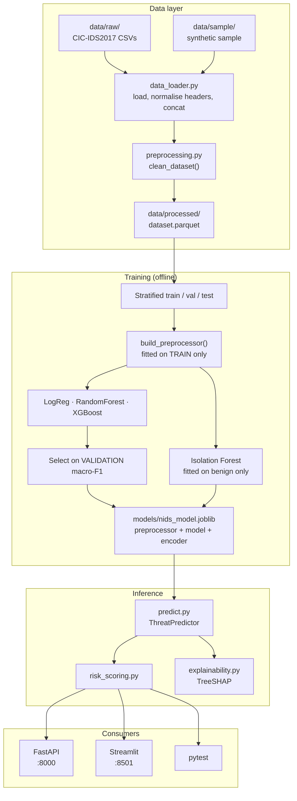
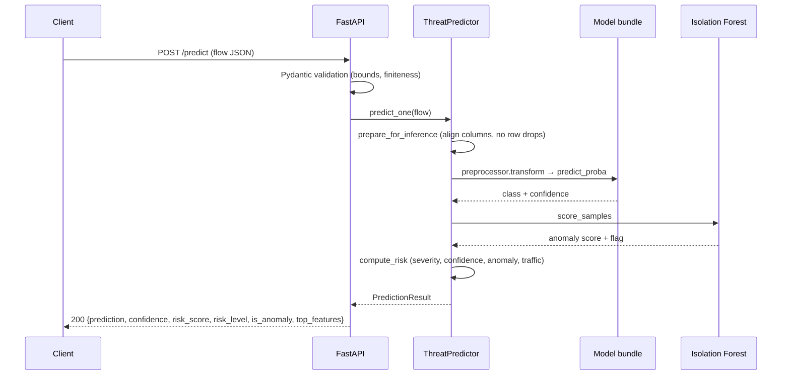

# AI-Powered Network Intrusion Detection System

A defensive network security system that classifies network flow records into
benign traffic or an attack family, scores every flow for anomalousness with an
independent unsupervised model, and exposes the result through a REST API and a
security operations dashboard.

Built as an end-to-end engineering project rather than a notebook: reusable
modules, a fitted-and-serialised preprocessing pipeline, a versioned model
artifact, a validated REST contract, 98 automated tests, and a container setup.

> **Read this first — about the metrics.**
> The numbers in [Results](#19-results) were produced by training on the
> **synthetic sample dataset bundled with this repository**, because
> CIC-IDS2017 is not redistributed here. They demonstrate that the pipeline
> executes correctly end to end. They are **not** CIC-IDS2017 results and say
> nothing about real-world detection performance. The synthetic generator draws
> each class from deliberately separable distributions, so the scores are
> inflated by construction. See [Dataset Setup](#13-dataset-setup) to reproduce
> on real data.

---

## Table of contents

1. [Project Overview](#1-project-overview)
2. [Problem Statement](#2-problem-statement)
3. [Motivation](#3-motivation)
4. [Architecture](#4-architecture)
5. [Features](#5-features)
6. [Dataset](#6-dataset)
7. [Machine Learning Approach](#7-machine-learning-approach)
8. [Feature Engineering](#8-feature-engineering)
9. [Model Comparison](#9-model-comparison)
10. [API Documentation](#10-api-documentation)
11. [Dashboard](#11-dashboard)
12. [Installation](#12-installation)
13. [Dataset Setup](#13-dataset-setup)
14. [Training](#14-training)
15. [Running the API](#15-running-the-api)
16. [Running the Dashboard](#16-running-the-dashboard)
17. [Docker Usage](#17-docker-usage)
18. [Testing](#18-testing)
19. [Results](#19-results)
20. [Limitations](#20-limitations)
21. [Future Improvements](#21-future-improvements)
22. [Project Structure](#22-project-structure)
23. [Screenshots](#23-screenshots)

---

## 1. Project Overview

The system ingests **network flow records** — statistical summaries of a
conversation between two hosts, not raw packets — and answers three questions
about each one:

| Question | Answered by | Output |
|---|---|---|
| What kind of traffic is this? | Supervised classifier (XGBoost / RF / LogReg) | Attack family + confidence |
| Is this unlike anything normal? | Isolation Forest, trained on benign traffic only | Anomaly score + flag |
| How urgently should a human look? | Composite risk scorer | 0–100 score + LOW/MEDIUM/HIGH/CRITICAL |

Keeping these three signals **separate and individually visible** is the central
design decision. An analyst can see that the classifier said "BENIGN" while the
anomaly detector disagreed — which is exactly the situation a novel attack
produces, and exactly the situation a single blended number would hide.

## 2. Problem Statement

Signature-based intrusion detection matches traffic against known-bad patterns.
It is precise and fast, but structurally blind to anything without a signature —
which includes every attack on its first day of existence.

Behavioural detection asks a different question: *does this traffic behave like
an attack?* A SYN flood is defined by its rate and directional asymmetry, not by
any byte sequence. A port scan is defined by many short probes receiving no
replies. These are statistical properties, so they are learnable from flow
features, and they generalise to variants a signature would miss.

The engineering problem this project addresses:

- **Severe class imbalance** — benign traffic outnumbers attacks by orders of
  magnitude, so accuracy is a misleading metric.
- **Asymmetric error costs** — a missed intrusion and a false alarm are not
  equally expensive.
- **Target leakage** — the most common failure in published NIDS work, where
  identifier columns produce 99.9% accuracy that collapses on any other network.
- **Train/serve skew** — the transformation used at inference silently drifting
  from the one used in training.

## 3. Motivation

I wanted a project where the machine learning was the *easy* part. Fitting a
classifier to CIC-IDS2017 is a few lines of scikit-learn. Making it into
something a security team could actually operate requires deciding what to do
about imbalance, which errors to prefer, how to keep the preprocessing identical
between training and serving, how to explain an alert to the analyst who has to
action it, and how to fail safely when the model is missing.

Every non-obvious decision in this repository is documented in the module
docstring next to the code that implements it, so it can be defended rather than
merely described.

## 4. Architecture



**Why the API and dashboard both call `ThreatPredictor` directly** rather than
the dashboard calling the API: they are independent consumers of one inference
layer, so neither can drift from the other, and a dashboard outage cannot take
detection offline. The API's reachability is displayed in the dashboard sidebar
for transparency.

### Request flow for a single prediction



## 5. Features

**Detection**
- Multi-class classification into 8 attack families
- Unsupervised anomaly detection for unseen attack types
- Composite 0–100 risk score with a documented, auditable component breakdown
- Per-prediction SHAP explanations

**Engineering**
- Preprocessing pipeline serialised *inside* the model artifact, eliminating a
  whole class of version-skew bugs
- Configuration entirely through environment variables; no hardcoded paths
- Graceful degradation: no anomaly detector → supervised still serves; no model
  at all → API starts degraded and returns 503 rather than crash-looping
- Structured logging that records request shape, never payload contents
- 98 automated tests covering preprocessing, inference, risk scoring, API
  contract and error paths

**Interfaces**
- REST API with OpenAPI docs, bounded uploads and sanitised validation errors
- Five-tab security dashboard including a simulated live monitor
- Batch CSV scoring with downloadable results

## 6. Dataset

### What CIC-IDS2017 is

A labelled intrusion detection dataset from the Canadian Institute for
Cybersecurity. Over five days in July 2017, researchers ran a testbed network
with scripted benign user behaviour and executed known attacks against it at
scheduled times. Traffic was captured as PCAP and summarised into flow records
using CICFlowMeter. Roughly **2.8 million flows across eight CSV files**.

### What a network flow represents

A flow is one bidirectional conversation identified by the 5-tuple *(source IP,
source port, destination IP, destination port, protocol)*. Rather than raw
bytes, each flow is described by ~78 statistical features: how long it lasted,
how many packets went each way, packet size distributions, inter-arrival time
statistics, TCP flag counts.

This matters for privacy and scale: flow records contain no payload, so the
system inspects traffic *behaviour* without reading content, and a million
packets collapse into a handful of rows.

### Attack categories

The raw dataset has ~15 fine-grained labels. This project collapses them into
eight operationally meaningful families (`src/config.py: LABEL_MAP`):

| Family | Raw labels folded in | Behavioural signature |
|---|---|---|
| BENIGN | BENIGN | Balanced bidirectional exchange |
| DDoS | DDoS | Very high packet rate, one-directional |
| DoS | Hulk, GoldenEye, slowloris, Slowhttptest | High rate or many stalled connections |
| PortScan | PortScan | Many short probes, near-zero replies |
| BruteForce | FTP-Patator, SSH-Patator | Repeated short auth attempts to one port |
| WebAttack | XSS, SQL Injection | HTTP flows with unusual payload shapes |
| Botnet | Bot | Periodic low-volume C2 beaconing |
| Infiltration | Infiltration | Rare, low-and-slow internal movement |

**Why collapse them:** several raw labels have fewer than 20 rows. A class with
11 examples cannot be learned, cannot be meaningfully cross-validated, and
produces per-class metrics that are noise. The families keep the taxonomy
actionable for an analyst while making the learning problem tractable.

### Dataset limitations

Worth stating plainly, because they bound every claim this project can make:

- **Synthetic testbed, not production traffic.** Benign behaviour was scripted.
  Real enterprise networks are far messier, so real-world false-positive rates
  will be higher than anything measured here.
- **2017 attack tooling.** Techniques have moved on.
- **Known labelling errors.** Subsequent research has documented mislabelled
  flows and duplicated records in the original release.
- **Fixed topology.** A small set of hosts with fixed roles, which is precisely
  why IP and port identifier columns must be dropped — a model that learns
  "traffic from 172.16.0.1 is an attack" has learned this lab, not attacks.
- **Class imbalance.** Benign traffic is ~80% of flows; Heartbleed is 11 rows.

### Why class imbalance matters

With ~80% benign traffic, a model that predicts BENIGN unconditionally scores
**80% accuracy while detecting nothing at all**. Accuracy is therefore not a
usable selection metric.

This project responds in four ways:
1. **Selects on macro-F1**, which averages per-class F1 with equal weight, so a
   rare class cannot be ignored.
2. **Reports per-class recall** so a class being silently missed is visible.
3. **Applies balanced class weights** so minority errors cost more during fitting.
4. **Downsamples the majority class in the training split only** — never in
   validation or test, which must retain the real distribution to give an honest
   estimate of the false-alarm rate.

## 7. Machine Learning Approach

### Splitting protocol

Three-way **stratified** split. Stratification is required because the rarest
class may have only dozens of rows, and an unstratified split can leave it
absent from a fold entirely.

The **test split is opened exactly once**, at the very end, for the winning
model only. All comparison and selection happens on validation. Selecting on
test would mean test labels influenced a decision, making the reported score
optimistically biased.

### Leakage prevention

Two distinct mechanisms:

1. **Identifier columns are dropped** (`LEAKAGE_COLUMNS`): flow ID, source and
   destination IP, source port, timestamp. These identify the capture's
   topology, not traffic behaviour.
2. **The preprocessor is fitted on training rows only.** The scaler's median and
   IQR and the encoder's category vocabulary are learned from train, then
   *applied* to validation and test. Fitting on the full dataset first would
   leak the held-out distribution into training.

### Handling imbalance

Class weighting rather than SMOTE. Synthetic oversampling interpolates between
existing minority points, which for network flows means fabricating traffic that
is not physically realisable — a flow with 2.5 packets and a fractional TCP flag
count. Weighting adjusts the loss without inventing data.

### Why recall and F1, not accuracy

A **false negative** is an undetected intrusion. A **false positive** is an
analyst spending a few minutes dismissing benign traffic. The costs differ by
orders of magnitude, which is why the project reports attack detection rate and
per-class recall prominently.

But false positives are not free, and this is the part usually skipped: an IDS
with a high false-alarm rate gets muted by the team operating it, at which point
every future true positive becomes a missed one. **A detector nobody trusts has
a real-world recall of zero.** The goal is high recall at a false-alarm rate a
human queue can actually absorb, which is why both are reported side by side.

## 8. Feature Engineering

Two dozen raw flow features plus nine derived ones. The derived features encode
domain knowledge that raw counts cannot express:

| Derived feature | Formula | Attack behaviour it targets |
|---|---|---|
| `packets_per_second` | total packets / duration | **DoS/DDoS.** A flood is defined by *rate*; a raw packet count cannot distinguish a flood from a long legitimate download. |
| `bytes_per_second` | total bytes / duration | Volumetric floods and bulk exfiltration. |
| `fwd_bwd_packet_ratio` | fwd / (bwd + 1) | **Port scans.** Normal TCP is roughly balanced; a scan sends many SYNs and receives nothing. The cleanest single scan indicator. |
| `fwd_bwd_byte_ratio` | fwd bytes / (bwd bytes + 1) | Separates "many small requests" (scanning, brute force) from "small request, huge response" (amplification, exfiltration). |
| `avg_packet_size_derived` | total bytes / total packets | Payload shape. Scans use empty packets; real sessions mix small ACKs and full-MTU segments. |
| `bytes_per_packet` | same basis | Reinforces payload-shape signal. |
| `tcp_flag_density` | all flag counts / total packets | **SYN floods and stealth scans.** Well-behaved flows use a few flags across their lifetime; floods push this towards 1 because nearly every packet is control-only. |
| `is_ephemeral_port` | dest port ≥ 49152 | Weak alone, useful for botnet C2 that avoids well-known ports. |
| `port_category` | service bucket | See below. |

**Why `destination_port` is bucketed, not scaled.** Port numbers are *nominal*,
not ordinal: port 443 is not "more" than port 80, and the gap between 22 and 23
carries no magnitude. Feeding the raw integer to a linear model is meaningless,
and tree models waste splits rediscovering the buckets. Encoding service
semantics directly (`http`, `https`, `ssh`, `dns`, `smb`, `database`,
`ephemeral`, …) also generalises: an SSH brute-force on a non-standard port
still lands in a sensible bucket.

**Deliberately not doing:** generating hundreds of polynomial interactions. Each
feature above targets a specific, nameable attack behaviour. Features I cannot
justify in an interview do not belong in the model.

**Safety.** Every ratio uses a guarded denominator (`+ 1` or `+ 1e-6`) because
zero-duration and zero-reply flows are *normal* in attack traffic, not edge
cases — SYN floods routinely report a duration of zero microseconds. Rate
features are clipped at the extreme tail so one degenerate flow cannot dominate
the scaler's variance estimate. Both behaviours are covered by tests.

## 9. Model Comparison

| Model | Why it's a candidate | Trade-off |
|---|---|---|
| **Logistic Regression** | Linear baseline. If a complex model can't beat it, the complexity isn't earning its keep. Fully interpretable coefficients. | Cannot express the conjunctive threshold logic attacks exhibit. |
| **Random Forest** | Bagged trees capture "high rate **and** high asymmetry" natively. Resists overfitting through averaging; built-in importances. | Larger artifact, slower inference than a linear model. |
| **XGBoost** | Sequential residual fitting; the standard strong baseline on tabular data. | Most hyperparameters, least directly interpretable. |

**Isolation Forest** is added as an unsupervised complement, fitted on **benign
traffic only** so it never sees an attack label. It isolates points using random
splits; anomalies need fewer splits to isolate, so shorter average path length
means more anomalous. Its purpose is the case the supervised model structurally
cannot handle — a flow whose attack type was absent from training. The
supervised model *must* map such a flow onto a known class; the detector can say
"this resembles nothing normal".

## 10. API Documentation

Interactive docs at `http://localhost:8000/docs`.

### `GET /health`

Returns 200 even when degraded, so an orchestrator doesn't kill a container
merely because no model has been deployed yet.

```json
{"status": "healthy", "model_loaded": true, "anomaly_detector_loaded": true,
 "api_version": "1.0.0", "uptime_seconds": 42.1}
```

### `POST /predict`

Only `destination_port` is required; every other feature is imputed with
training-set medians. Unknown extra fields are accepted and ignored, so a full
78-column CICFlowMeter record can be posted without trimming.

```bash
curl -X POST http://localhost:8000/predict \
  -H "Content-Type: application/json" \
  -d '{"destination_port": 80, "protocol": 6, "flow_duration": 3000,
       "total_fwd_packets": 480, "total_backward_packets": 1,
       "flow_packets_s": 160000.0, "syn_flag_count": 480}'
```

Response shape (values depend entirely on the input and the trained model):

```json
{
  "prediction": "DDoS",
  "confidence": 0.9991,
  "risk_score": 87,
  "risk_level": "CRITICAL",
  "is_anomaly": true,
  "anomaly_score": 0.6838,
  "is_malicious": true,
  "class_probabilities": {"BENIGN": 0.0002, "DDoS": 0.9991, "...": 0.0007},
  "risk_components": {"class_severity": 88.0, "model_confidence": 99.8,
                      "anomaly": 68.4, "traffic_characteristics": 75.0},
  "indicators": ["High packet rate (160,280 pkt/s)", "High byte rate (9.6 MB/s)"],
  "top_features": [{"feature": "syn_flag_count", "display_name": "SYN Flag Count",
                    "contribution": 4.2215, "direction": "increases", "value": 480.0}]
}
```

Query params: `explain` (default `true`), `top_k` (1–20, default 5).

### `POST /predict/batch`

Multipart CSV upload. Returns summary statistics over all rows plus a bounded
preview.

```bash
curl -X POST "http://localhost:8000/predict/batch?preview_rows=50" \
  -F "file=@data/sample/sample_flows.csv"
```

### `GET /model-info`

Model name, version, training timestamp, supported classes, feature count and
stored metrics.

### Error handling

| Status | Cause |
|---|---|
| 400 | Non-CSV extension, empty file, unparseable or non-UTF-8 content |
| 413 | Upload above the configured size limit |
| 422 | Validation failure — out-of-range port, negative count, wrong type, non-finite value |
| 500 | Unexpected server error (logged with a request ID, never echoed to the client) |
| 503 | No model loaded |

Validation errors report the **field path and reason but not the submitted
value**. FastAPI's default handler echoes input back, which both breaks on
non-serialisable values like `Infinity` and is a habit worth avoiding in a
service whose job is handling hostile input.

## 11. Dashboard

Five tabs at `http://localhost:8501`:

| Tab | Contents |
|---|---|
| **Overview** | Totals, benign/malicious counts, attack rate, anomaly and critical counts; attack distribution and risk breakdown charts; stacked traffic timeline; top-25 threat table with masked IPs |
| **Flow Analyzer** | Manual feature entry with three starting templates; returns prediction, confidence, risk, anomaly status, a SHAP contribution chart, the risk-component breakdown and the full probability distribution |
| **CSV Analyzer** | Upload and score a file; summary metrics, attack distribution, high-risk table, downloadable full results |
| **Live Monitor** | Replays stored flows through the model with an auto-advance toggle, running counters and a rolling event table |
| **Model Performance** | Validation comparison table, per-class F1/recall, interactive confusion matrix, raw metrics JSON |

Source and destination addresses are masked to their `/16` prefix before display
— the dashboard is a demo surface that may be screenshotted, and the subnet is
what an analyst triages on anyway.

**The Live Monitor is simulated.** It reads rows from a stored CSV. It does not
capture from a network interface and shows no production traffic. This is
labelled in the UI itself, not just here.

## 12. Installation

```bash
git clone <repository-url>
cd network-intrusion-detection

python -m venv .venv
source .venv/bin/activate        # Windows: .venv\Scripts\activate

pip install -r requirements.txt
cp .env.example .env             # optional; every value has a working default
```

Requires Python 3.11+.

## 13. Dataset Setup

### Option A — run immediately with the bundled synthetic sample

```bash
python scripts/generate_sample_data.py
python scripts/prepare_data.py --use-sample
python scripts/train_model.py
```

Produces a working model in under a minute so the API and dashboard are
explorable. **The resulting metrics are meaningless as detection performance** —
the generator draws classes from separable distributions by design.

### Option B — real CIC-IDS2017

1. Download the **MachineLearningCSV** archive from
   <https://www.unb.ca/cic/datasets/ids-2017.html>
2. Extract the eight CSVs into `data/raw/`:

```
data/raw/
├── Monday-WorkingHours.pcap_ISCX.csv
├── Tuesday-WorkingHours.pcap_ISCX.csv
├── Wednesday-workingHours.pcap_ISCX.csv
├── Thursday-WorkingHours-Morning-WebAttacks.pcap_ISCX.csv
├── Thursday-WorkingHours-Afternoon-Infilteration.pcap_ISCX.csv
├── Friday-WorkingHours-Morning.pcap_ISCX.csv
├── Friday-WorkingHours-Afternoon-PortScan.pcap_ISCX.csv
└── Friday-WorkingHours-Afternoon-DDos.pcap_ISCX.csv
```

3. Run the pipeline:

```bash
python scripts/prepare_data.py
python scripts/train_model.py
```

The dataset is **not committed** — it is ~500 MB and redistribution is governed
by its own licence. `data/raw/` is gitignored except for `.gitkeep`.

Low-memory machines:

```bash
python scripts/prepare_data.py --chunksize 100000        # stream each CSV
python scripts/prepare_data.py --nrows-per-file 50000    # quick smoke run
```

## 14. Training

```bash
python scripts/train_model.py                  # default
python scripts/train_model.py --cross-validate # add stratified k-fold CV
python scripts/train_model.py --all-features   # every numeric column, not just core
python scripts/train_model.py --no-balance     # skip majority downsampling
```

Writes `models/nids_model.joblib` (preprocessor + model + label encoder +
metadata in one artifact), `models/anomaly_detector.joblib`, and
`reports/metrics.json`.

**Why one artifact:** if the preprocessor and classifier were saved separately,
nothing would stop v2 of the model being loaded with v1 of the scaler — silent,
extremely hard-to-debug train/serve skew. One file, one version, one consistent
transformation.

## 15. Running the API

```bash
uvicorn api.main:app --reload
```

Docs at `http://localhost:8000/docs`.

## 16. Running the Dashboard

```bash
streamlit run dashboard/app.py
```

At `http://localhost:8501`. The dashboard scores locally and does not require
the API to be running.

## 17. Docker Usage

```bash
docker compose up --build
```

Starts both services from one image:

| Service | Port | URL |
|---|---|---|
| `api` | 8000 | http://localhost:8000/docs |
| `dashboard` | 8501 | http://localhost:8501 |

```bash
docker compose up -d          # detached
docker compose logs -f api    # follow logs
docker compose down           # stop
docker compose build --no-cache
```

`models/`, `data/` and `reports/` are bind-mounted, so retraining on the host is
picked up by a container restart without a rebuild. The image uses a multi-stage
build (compilers stay in the builder stage) and runs as an unprivileged UID —
a container parsing untrusted CSV uploads should not do so as root.

To train inside the container:

```bash
docker compose run --rm api python scripts/prepare_data.py --use-sample
docker compose run --rm api python scripts/train_model.py
```

## 18. Testing

```bash
pytest                        # all 98 tests
pytest -v                     # verbose
pytest tests/test_api.py      # one module
pytest --cov=src --cov=api    # with coverage (needs pytest-cov)
```

| Module | Tests | Covers |
|---|---|---|
| `test_preprocessing.py` | 39 | Header and label normalisation, idempotence, deduplication, infinity handling, leakage-column removal, derived features, zero-duration and zero-reply edge cases, pipeline width stability, unseen categories |
| `test_prediction.py` | 32 | Bundle integrity, disk round-trip equivalence, single vs batch consistency, partial and extra features, risk-band boundaries, severity ordering, anomaly floor, graceful degradation |
| `test_api.py` | 27 | Every endpoint, OpenAPI schema, six invalid-payload cases, non-finite rejection, upload restrictions, preview bounding, degraded-mode 503s |

Tests train a real model on a small synthetic fixture rather than mocking the
estimator, so they exercise the same preprocessing, encoding and serialisation
path that production uses. Artifacts are written to a temp directory, never the
repository.

## 19. Results

> **These numbers come from the synthetic sample, not CIC-IDS2017.** The
> generator produces separable classes, so scores are inflated by construction.
> They demonstrate the pipeline runs correctly and nothing more. Reproduce with
> `python scripts/generate_sample_data.py && python scripts/prepare_data.py
> --use-sample && python scripts/train_model.py`.

Dataset: 20,000 synthetic flows, 8 classes, 29 raw features → 52 after encoding.

**Validation split — model comparison** (selection basis):

| Model | Accuracy | Macro F1 | Macro Recall | ROC-AUC (OvR) | Detection Rate | False Alarm Rate |
|---|---|---|---|---|---|---|
| **XGBoost** ← selected | 0.9850 | **0.9749** | 0.9788 | 0.9993 | 0.9861 | 0.0159 |
| RandomForest | 0.9778 | 0.9611 | 0.9516 | 0.9988 | 0.9674 | 0.0136 |
| LogisticRegression | 0.9409 | 0.9142 | 0.9630 | 0.9980 | 0.9875 | 0.0926 |

**Held-out test split — selected model only** (opened once):

| Metric | Value |
|---|---|
| Accuracy | 0.9860 |
| Macro F1 | 0.9767 |
| Weighted F1 | 0.9860 |
| Macro recall | 0.9769 |
| Attack detection rate | 0.9856 |
| False alarm rate | 0.0132 |
| False negatives (missed attacks) | 26 |
| False positives (analyst noise) | 29 |

A genuinely interesting result even on synthetic data: **Logistic Regression has
the highest detection rate (0.9875) of all three models** — but at a 9.3% false
alarm rate, roughly six times XGBoost's. It catches marginally more attacks by
flagging far more benign traffic. This is exactly the trade-off that makes
accuracy useless here and why selection uses macro-F1.

To reproduce on real data, follow [Option B](#option-b--real-cic-ids2017) and
replace this section with your own output. **Do not report these numbers as
CIC-IDS2017 results.**

## 20. Limitations

**Honest scope boundaries:**

1. **No real-dataset results are claimed here.** Everything in §19 is synthetic.
2. **Flow-level, not packet-level.** The system cannot detect anything invisible
   in flow statistics — payload-based exploits with normal traffic shape.
3. **Not real-time.** It scores flow records that a collector has already
   produced. Flow export typically lags by seconds to minutes.
4. **Trained on 2017 testbed traffic.** Real-world false positives will be
   substantially higher than testbed measurements suggest.
5. **The risk score is a heuristic.** Fixed weights (0.45 severity, 0.25
   confidence, 0.20 anomaly, 0.10 traffic) chosen by reasoning, not optimised
   against labelled analyst triage decisions. It is defensible and auditable,
   not calibrated. **Not a production security standard.**
6. **Anomaly scores are not probabilities.** A 0.94 means "in the top few
   percent of unusual relative to training traffic", not "94% likely malicious".
7. **No adversarial robustness.** An attacker who knows the feature set can
   likely evade it by shaping traffic — padding packets, adding jitter. Not
   evaluated.
8. **No concept-drift handling.** Traffic distributions shift; there is no
   retraining trigger or drift monitor.
9. **No authentication on the API.** It is designed to sit behind a gateway.
10. **SHAP for correlated features spreads attribution** across the correlated
    group, so a single feature's contribution can look smaller than its true
    importance.

## 21. Future Improvements

- **Threshold tuning per class** — optimise the decision threshold against an
  explicit false-negative:false-positive cost ratio rather than using argmax.
- **Calibration** — Platt scaling or isotonic regression so `confidence` is an
  actual probability; currently it is an uncalibrated softmax output.
- **Drift detection** — monitor feature distributions against the training
  reference and alert when they diverge.
- **Live capture** — a Zeek or CICFlowMeter collector feeding the API.
- **Model registry and CI** — MLflow for versioning; GitHub Actions running
  pytest and a training smoke test on every push.
- **Risk-weight learning** — replace the hand-set weights with weights fitted to
  labelled analyst triage decisions.
- **Sequence models** — flows are independent here, but attacks are campaigns; a
  temporal model over flows from one source could catch slow scans that look
  benign one flow at a time.

## 22. Project Structure

```
network-intrusion-detection/
├── data/
│   ├── raw/                    # CIC-IDS2017 CSVs (gitignored)
│   ├── processed/              # cleaned parquet (gitignored)
│   └── sample/                 # synthetic sample (committed)
├── models/                     # trained artifacts (gitignored)
├── notebooks/
│   ├── 01_eda.ipynb
│   └── 02_model_experiments.ipynb
├── src/
│   ├── config.py               # paths, taxonomy, hyperparameters, logging
│   ├── data_loader.py          # CSV discovery, loading, header normalisation
│   ├── preprocessing.py        # cleaning, balancing, the sklearn pipeline
│   ├── feature_engineering.py  # derived features, port bucketing
│   ├── train.py                # candidates, splits, selection, persistence
│   ├── evaluate.py             # metrics, security-specific views
│   ├── predict.py              # ThreatPredictor - the single inference path
│   ├── anomaly_detection.py    # Isolation Forest + score normalisation
│   ├── risk_scoring.py         # composite risk model
│   └── explainability.py       # SHAP with graceful fallbacks
├── api/
│   ├── main.py                 # FastAPI app, middleware, error handling
│   └── schemas.py              # Pydantic request/response contract
├── dashboard/app.py            # Streamlit SOC dashboard
├── tests/                      # 98 tests
├── scripts/
│   ├── generate_sample_data.py
│   ├── prepare_data.py
│   └── train_model.py
├── docs/INTERVIEW_PREP.md
├── Dockerfile
├── docker-compose.yml
├── requirements.txt
├── .env.example
└── README.md
```

## 23. Screenshots

Not included. The dashboard is verified to run by an automated test
(`streamlit.testing.AppTest`, zero exceptions), and I would rather ship no
screenshots than screenshots of synthetic data presented as if they showed real
detections. Run `streamlit run dashboard/app.py` after training to see it live.

---

## Licence

MIT — see [LICENSE](LICENSE).

## Acknowledgements

CIC-IDS2017 was produced by the Canadian Institute for Cybersecurity, University
of New Brunswick. If you use the dataset, cite their original paper:

> I. Sharafaldin, A. H. Lashkari, A. A. Ghorbani. *Toward Generating a New
> Intrusion Detection Dataset and Intrusion Traffic Characterization.* ICISSP,
> 2018.
